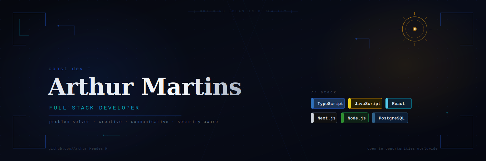

  

 

I'm a Full Stack Developer based in São Paulo, Brazil, currently working at a **banking security company** where I build and maintain systems that need to be both reliable and secure. Outside of my day job, I take on freelance projects — some already live with real users, others in production soon.

I enjoy turning ideas into working products. Not just writing code, but understanding the problem first and finding the clearest path to a solution. That's the part I find most interesting.

I'm actively looking for **remote freelance work or full-time remote positions** with international companies. Open to long-term contracts, project-based work, or anything in between.

---

## What I work with

**Frontend**

**Backend**

**Data & Cloud**

**Security & Tooling**

---

## Selected work

**[CTF Platform](https://github.com/Arthur-Mendes-M/ctf-platform)** — A Capture the Flag platform built with Next.js and TypeScript, with a full backend and hosted database. Developed collaboratively for a cybersecurity event. Live at [ctfv2.vercel.app](https://ctfv2.vercel.app).

**[Shopiac](https://github.com/Arthur-Mendes-M/shopiac)** — E-commerce frontend for a live product, built as a freelance delivery. React + TypeScript + Tailwind. Integrated with a Go backend developed by a partner. Currently serving real customers.

**[StockWise](https://github.com/Arthur-Mendes-M/stockwise-platform)** — Full-stack inventory and stock management platform. I built both the React frontend and the backend API. Deployed and functional.

**[Stafflink](https://github.com/Arthur-Mendes-M/stafflink)** — HR management system for small and medium-sized companies. Node.js backend with a full frontend. 126 commits. Live demo available.

**[Fastify TS Zod Starter](https://github.com/Arthur-Mendes-M/fastify-ts-zod-starter)** — A RESTful API boilerplate using Fastify, TypeScript, Zod for schema validation, and auto-generated Swagger docs. Built as a reusable starting point for production APIs.

---

## GitHub stats

  
  

---

## Certifications

| | Course | Institution |
|---|---|---|
| 🔄 | Junior Cybersecurity Analyst Career Path | Cisco Networking Academy |
| ✅ | Cybersecurity Essentials | Cisco |
| ✅ | Full Stack JS Developer | OneBitCode |
| ✅ | Mastering Node.js | OneBitCode |
| ✅ | Mastering React | OneBitCode |
| ✅ | Advanced JavaScript | OneBitCode |

---

## Let's connect

> *Open to remote work worldwide — async-friendly, security-aware, and genuinely excited about solving real problems.*
